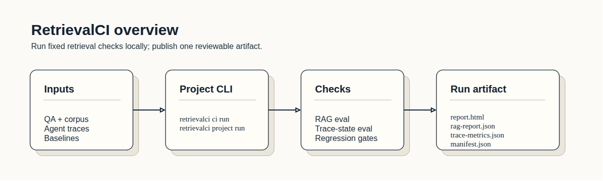
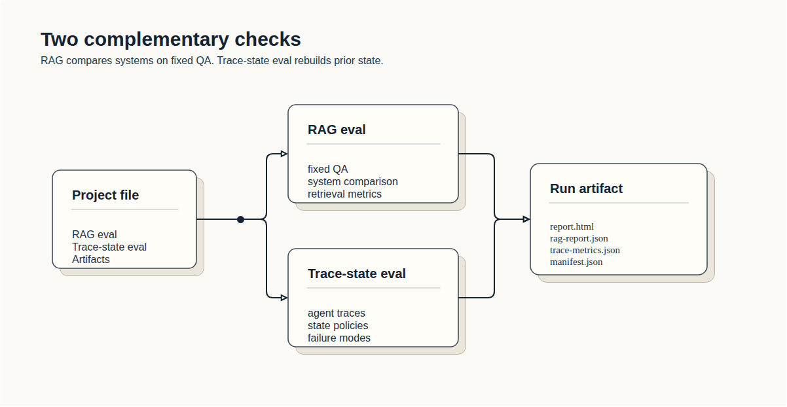
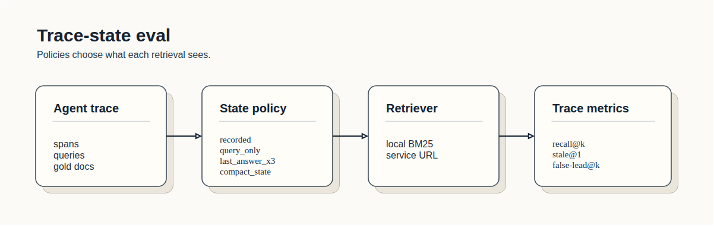

# RetrievalCI

> **Stage**: `bench-v0` early preview. Methodology, scorecard format, and system adapters are stable. More corpora, more adapters, and per-tier breakdowns coming. MIT licensed, 253 tests, $0.17 to reproduce the public scorecard.

**RetrievalCI measures retrieval quality across hosted RAG services and local retrieval architectures on a shared corpus and citation contract.** On bench-v0 (50 enterprise questions, 81 docs), the four major hosted services score 78-84 on retrieve-only quality (0.7·recall + 0.3·precision). A free-CPU MiniLM local stack scores 45-50 on the same fixture. **Most of that gap is embedder size, not retrieval architecture** — a stronger local embedder (bge-large-en) closes the bulk of it. Full decomposition under [research findings](#research-findings-so-far).

This kind of side-by-side measurement doesn't exist anywhere else in one place. Vendor blogs report on their own benchmarks; open-source RAG papers don't compare to hosted services. RetrievalCI is the harness that produces it for *your* corpus, in CI, with one command.

## Scorecard

<!-- BEGIN retrievalci scorecard -->

_Generated from `bench-v0 / 4 hosted RAG services, same corpus + questions + citation contract` — do not edit by hand._

```text
score = 100 * (0.7 * retrieval_source_recall + 0.3 * retrieval_source_precision)
```

| System | Score | Recall | Precision | p50 retrieve (ms) | Status |
| --- | ---: | ---: | ---: | ---: | --- |
| Vertex AI RAG Engine | 82.6 | 94.5% | 54.7% | 358.4 | Measured |
| Bedrock KB (Cohere embed) | 82.5 | 87.9% | 70.1% | 408.1 | Measured |
| OpenAI File Search | 78.5 | 89.3% | 53.4% | 1358.3 | Measured |
| Azure AI Search (Gemini embed) | 84.0 | 90.9% | 67.8% | 408.4 | Measured |

<!-- END retrievalci scorecard -->

Score = `100 × (0.7 × recall + 0.3 × precision)`. All four services index the same 81 docs, are asked the same 50 questions (25 single-hop, 15 multi-hop, 5 contradiction, 5 unanswerable, stratified from [EnterpriseRAG-Bench](https://github.com/onyx-dot-app/EnterpriseRAG-Bench) v1.0.0), and return chunks that we map back to repo-relative paths via a fail-closed manifest. Recall and precision are computed against the same `ground_truth_citations`. The latency column is retrieve-only (no generation).

## Why this exists

Most RAG eval tooling targets **generation quality**: faithfulness, answer relevance, hallucination grading. RetrievalCI targets **retrieval quality** — and specifically, the apples-to-apples comparison of hosted RAG services that you can't get from anywhere else:

| Tool | Compares hosted RAG services? | Notes |
| --- | --- | --- |
| **RetrievalCI** | ✅ Vertex + Bedrock + Azure + OpenAI File Search on identical inputs | This repo |
| RAGAS | ❌ Generation-quality framework | Faithfulness / context precision metrics for your own pipeline |
| Phoenix / Arize | ❌ LLM observability | Runtime tracing, not pre-launch CI |
| TruLens | ❌ Custom feedback functions | BYO feedback definitions, no hosted comparison |
| LangSmith | ❌ Hosted experiment tracker | SaaS dependency, no vendor-neutral benchmark |
| Vendor blogs | ❌ Self-reported | Each vendor on their own benchmark — not directly comparable |

If you're choosing between Vertex / Bedrock / Azure / OpenAI for an enterprise RAG deployment and want measured numbers on your own corpus before signing the contract, that's the gap this fills.

## Research findings (so far)

We used RetrievalCI's harness to test Karpathy's "LLM Wiki" hypothesis across two corpora and eight rounds of pre-registered ablations. The short version:

- **Wiki+RAG beats vanilla RAG by +0.30** retrieval-source-recall on multi-source corpora (K8s documentation, 174 docs, 10 hand-authored questions).
- **The win is at retrieval, not generation.** Synthesized prose contributes ~0 at answer time — it works as embedder fuel, not LLM input. Karpathy's framing pointed at the right feature for the wrong reason.
- **Roughly half the win is lexical**, replicable by appending entity names to chunk text with zero LLM calls. **The other half is genuine synthesis-derived semantic content** in the embedding text.
- **A stronger embedder beats the architecture per dollar.** Same wiki prose, swap MiniLM-L6-v2 for bge-large-en: +0.05 lift at zero API cost (just a 1.3 GB local model download).
- **Wiki+RAG loses on single-source corpora** where each fact appears once. The architecture assumes multi-source compounding; without it, page-aggregation drops answer-relevant content into the singleton tail.

Full ablation chain, pre-registrations, and per-condition decomposition are kept in an internal research log. The distillation-cost decomposition — how cheaply each portion of the wiki lift can be captured — is testable end-to-end via `make ablation-distill`.

## Quick start

```bash
git clone <repo>
cd searchtrace
python -m venv .venv && .venv/bin/pip install -e '.[dev,providers,hosted-aws]'
make bench-v0-mock         # 0 cost, 0 credentials, validates the harness
```

Add `GOOGLE_OAUTH_*` / `AWS_*` / `OPENAI_API_KEY` / `AZURE_SEARCH_*` to `.env` (see [API keys](#api-keys)), then:

```bash
python scripts/run_bench_v0_vertex.py  run --questions ... --corpus-dir ... --output ...
python scripts/run_bench_v0_bedrock.py run ...
python scripts/run_bench_v0_openai.py  run ...
python scripts/run_bench_v0_azure.py   run ...
make bench-v0-scorecard    # regenerates the table in this README
```

Each adapter has a `cleanup` subcommand to enumerate and delete any stranded cloud resources. The `RunBudget` cost cap is `$20` by default — pre-flight + in-flight, hard-stops past it.

## What's in the box

- **4 hosted-RAG adapters**, each implementing the `HostedSystem` protocol with cost-capped lifecycle (provision → ingest → query → teardown) — Vertex AI RAG Engine, Bedrock KB on OpenSearch Serverless, OpenAI Vector Stores, Azure AI Search
- **bench-v0 fixture** under `examples/rag_eval/bench_v0/` — 50 questions, 81 corpus docs, MIT-licensed, fully reproducible
- **5 local retrieval baselines** (BM25, dense, hybrid-RRF, dense-rerank, chunk-summary) — for CI regression checks against your own stack; not part of the headline scorecard because the gap to hosted is dominated by free-CPU embedder size rather than retrieval architecture
- **Scorecard generator** that reads `ComparisonReport` JSON and rewrites the README between `<!-- BEGIN/END retrievalci scorecard -->` markers — no hand-edited numbers
- **Rejudge mode** (`retrievalci rag rejudge`) to re-score existing reports with a different judge backend without re-running generators
- **Trace-state eval** (separate flow) — replay agent trace logs to expose zero-recall, drift, stale evidence, false-lead capture



## Methodology + caveats

- **bench-v0 is synthetic enterprise data** from EnterpriseRAG-Bench v1.0.0 (fictional companies like "Streamly AI" across GitHub PRs, Slack threads, Linear issues, Drive docs). It's *not* public web content, so a web-search service like Tavily can't be benchmarked on it without a category mismatch.
- **All four hosted services hallucinate on every unanswerable question** (`abstention_correctness=0.0` on the 5 `info_not_found` rows). This is the next prompt-engineering / retrieval-thresholding target.
- **Mode A only**. The current scorecard is retrieve-only — no LLM-generation step. Mode B (native-stack grounded generation) is implemented for hosted adapters but not yet in the headline scorecard.
- **bench-v0 is 50 questions**. bench-v1 (150) and bench-v2 (full 500-question ERB) are in the plan doc. Take the absolute scores as point-in-time signal, not gospel.

Read the full methodology + rationale in [`docs/rag_eval/results/hosted-rag-benchmark-plan.md`](docs/rag_eval/results/hosted-rag-benchmark-plan.md).

## Install

RetrievalCI requires Python 3.12 or newer.

```bash
python -m venv .venv
.venv/bin/python -m pip install --upgrade pip
.venv/bin/python -m pip install -e '.[dev]'
```

The smoke examples use mock/provider-free backends. Provider extras are only
needed when you want to run real LLM or embedding providers:

```bash
.venv/bin/python -m pip install -e '.[providers]'
```

Provider extras are bounded to SDK major versions that RetrievalCI has adapter
coverage for. If a provider releases a new major SDK, update the backend adapter
and version bound together.

## API keys

RetrievalCI runs end-to-end with **no API keys** using the bundled mock backend
(`make smoke-rag`, `make smoke-rag-config`). Keys are only needed once you want
real LLM generation, real LLM judging, or hosted RAG service adapters.

Place keys in a `.env` file at the repo root, or export them in your shell.
RetrievalCI does not bundle a `.env` loader; use your shell or `direnv`.

**Required: none.** Smoke tests, BM25 baselines, and the mock generator/judge
pipeline all work without provider credentials.

**Optional — enables a real LLM generator or judge for local systems:**

| Backend | Variable | Used for |
| --- | --- | --- |
| Gemini (flash) | `GOOGLE_API_KEY` or `GEMINI_API_KEY` | Gemini generator (flash-lite) and embedder (public Gemini API, not Vertex AI) |
| Gemini Pro judge | `GEMINI_API_KEY_PRO` (optional override) | When `GeminiJudge` runs a Pro-family model, it prefers this key. Lets a Pro/Ultra subscription key serve judging while a separate free-tier key serves generator and embedder. Falls back to the standard chain if unset. |
| OpenAI | `OPENAI_API_KEY` | OpenAI judge today; OpenAI File Search adapter when shipped |
| Anthropic | `ANTHROPIC_API_KEY` | Claude generator and judge |
| Groq | `GROQ_API_KEY` | Groq generator and judge |

Each backend raises at construction time if its key is missing, so unused
backends never demand a key.

**Cost safety**: defaults are pinned to free-tier-eligible Gemini models
(`gemini-2.5-flash-lite` generator, `gemini-embedding-001` embedder). The
`GeminiJudge` default is `gemini-2.5-pro`, which has a tighter free-tier
daily quota (~100 RPD) — judging a 50-question benchmark may need a
Pro/Ultra subscription key on `GEMINI_API_KEY_PRO`, or a wait for the
midnight Pacific quota reset. The pinned defaults are guarded by
`test_gemini_defaults_match_free_tier_policy` so a future contributor
cannot silently regress them.

**Required only for specific hosted-RAG adapters (not yet shipped):**

These adapters are described in
[docs/rag_eval/results/hosted-rag-benchmark-plan.md](docs/rag_eval/results/hosted-rag-benchmark-plan.md).
None of them are implemented yet; the credentials below are what each adapter
will require when added.

| Adapter | Credential | Notes |
| --- | --- | --- |
| Google Vertex AI RAG Engine | GCP service account JSON (`GOOGLE_APPLICATION_CREDENTIALS=/path/to/sa.json`) or Application Default Credentials from `gcloud auth application-default login` | The service account needs `roles/aiplatform.user` plus read access to the corpus bucket. A `GEMINI_API_KEY` alone is **not** sufficient — Vertex AI is a separate authentication surface. |
| Amazon Bedrock Knowledge Bases | `AWS_ACCESS_KEY_ID`, `AWS_SECRET_ACCESS_KEY`, `AWS_DEFAULT_REGION` (or an IAM role on the host machine) | IAM principal needs `bedrock:Retrieve` and `bedrock:RetrieveAndGenerate`. |
| Azure AI Search | `AZURE_SEARCH_ENDPOINT`, `AZURE_SEARCH_ADMIN_KEY` | Admin key for index management at adapter `index()` time; query key works for `answer()` only. |
| OpenAI File Search | `OPENAI_API_KEY` | Same key as the OpenAI judge above. |

Hosted-RAG runs are gated by a tight default budget cap (currently $20 and 50
questions per run). Larger runs require explicit operator override; see
`retrievalci/rag_eval/hosted.py` (`RunBudget`).

**Known limitation: `RunBudget` protects against runaway *query volume* only.**
Hosted RAG services (Vertex AI RAG Engine, Bedrock Knowledge Bases, Azure AI
Search, OpenAI File Search) bill for several cost lines that fall *outside*
the per-question cap:

- **Index storage** (Spanner-hour for Vertex, OCU-hour for Bedrock with
  OpenSearch Serverless, search-unit-hour for Azure, vector-store-byte-month
  for OpenAI) accrues for as long as the provisioned index exists, regardless
  of whether queries are issued. A 50-query run can finish cleanly under the
  $20 cap and still bill more than that in storage if the index is not torn
  down.
- **One-time ingestion / embedding cost** when the corpus is first uploaded.
- **Generation cost** in Mode B (native-stack) evaluation.

Until adapter-level `teardown()` discipline and a storage-aware budget are
implemented, operators of hosted adapters must manually delete provisioned
indexes after each run. The plan tracks this as an open item; see
[docs/rag_eval/results/hosted-rag-benchmark-plan.md](docs/rag_eval/results/hosted-rag-benchmark-plan.md).

## Quick start

Run the full local check:

```bash
make check
```

Then run the bundled CI-style evaluation:

```bash
.venv/bin/retrievalci ci run --config examples/retrievalci.ci.yaml
```

The CI command writes a run directory under `.retrievalci/runs/`:

```text
.retrievalci/runs/<run-id>/
├── manifest.json
├── report.html
├── rag-report.json
└── trace-metrics.json
```

A RAG report includes a deterministic diagnosis section:

```markdown
## Diagnosis

- Leader: `rag` on `retrieval_source_recall`.
- Bottleneck: `retrieval_limited`.
- Weakest tier: `multi_hop`.
- Recommendation: Prioritize retrieval changes before answer-prompt changes.
- Next experiment: Try hybrid retrieval, reranking, better embeddings, or higher top-k.
```

The bundled example data lives in `examples/`:

- `examples/rag_eval/corpus/*.md`: small public support-desk corpus.
- `examples/rag_eval/questions.jsonl`: held-out RAG eval questions.
- `examples/rag_eval/bench_v0/`: 50-question hosted-RAG benchmark fixture
  stratified from EnterpriseRAG-Bench v1.0.0 (25 single_hop / 15 multi_hop
  / 5 contradiction / 5 unanswerable). See the
  [hosted-RAG benchmark plan](docs/rag_eval/results/hosted-rag-benchmark-plan.md).
- `examples/third_party/`: compact WixQA and EnterpriseRAG-Bench fixtures
  converted to RetrievalCI format.
- `examples/corpus.demo.jsonl`, `examples/traces.demo.jsonl`, and
  `examples/otel.spans.demo.json`: trace-state replay fixtures.

## CI workflow

This repo includes a GitHub Actions workflow:

```text
.github/workflows/retrievalci-ci.yml
```

It runs lint, tests, `retrievalci ci run --config examples/retrievalci.ci.yaml`,
and uploads `.retrievalci/runs` as the review artifact. See
[docs/CI.md](docs/CI.md) for baseline and artifact conventions.

The two checks below share the same project file and run artifact.



## RAG architecture eval

Run a config-driven mock eval:

```bash
.venv/bin/retrievalci rag run --config examples/rag_eval/smoke.yaml
```

Run bundled third-party RAG examples:

```bash
.venv/bin/retrievalci rag run --config examples/third_party/wixqa/smoke.yaml
.venv/bin/retrievalci rag run --config examples/third_party/enterprise_rag_bench_github/smoke.yaml
```

Use `scripts/import_third_party_examples.py` to refresh or expand the local
WixQA and EnterpriseRAG-Bench fixtures under ignored `data/third_party/`.

Compare a candidate report against a baseline:

```bash
.venv/bin/retrievalci rag compare \
  --baseline baselines/rag/smoke.json \
  --candidate reports/pr.json \
  --metric retrieval_source_recall \
  --max-drop 0.02
```

`rag compare` exits `2` on regression, so it can be used directly in CI.

## Trace-state eval

Trace-state policies control what each replayed retrieval call can see, such as
the recorded prompt, only the current query, or compacted recent answer state.



Normalize a span export:

```bash
.venv/bin/retrievalci traces normalize \
  --source otel \
  --input examples/otel.spans.demo.json \
  --out /tmp/retrievalci-traces.demo.jsonl \
  --require-gold
```

Replay retrieval-state policies:

```bash
.venv/bin/retrievalci traces eval \
  --traces /tmp/retrievalci-traces.demo.jsonl \
  --corpus examples/corpus.demo.jsonl \
  --out /tmp/retrievalci-trace-report \
  --k 1 \
  --policies recorded,query_only,last_answer_x3,compact_state \
  --gate-policy last_answer_x3 \
  --min-recall-at-5 0.90
```

Use `--retriever-url` when you want RetrievalCI to call a deployed retriever
instead of the local BM25 replay baseline.

## Project file

Run RAG eval, trace normalization, trace replay, gates, and report generation
from one YAML file:

```bash
.venv/bin/retrievalci project run --config examples/retrievalci.project.yaml
```

`retrievalci ci run --config ...` is an alias for the same project workflow.

## CLI aliases

The `retrievalci` command is the preferred interface. The package also exposes
stable script aliases for automation: `rci-rag-eval`, `rci-rag-compare`,
`rci-report-build`, `rci-runs-create`, `rci-runs-list`, `rci-project-run`,
`rci-eval-traces`, and `rci-normalize-traces`.

## Package map

```text
retrievalci/
  rag_eval/             RAG systems, metrics, diagnostics, regression checks
  trace_eval.py         Trace-state replay, metrics, gates, Markdown reports
  trace_retrievers.py   HTTP adapter for production retriever replay
  trace_adapters.py     Generic and OpenTelemetry/Phoenix span normalization
  reporting.py          Self-contained HTML report builder
  runs/                 Local run registry and schema-versioned manifests
  project.py            Project YAML to run-spec mapping
  cli.py                CLI dispatcher
```

## More docs

- [CONTRIBUTING.md](CONTRIBUTING.md): local setup, checks, and data-handling
  expectations for contributors.
- [docs/ARCHITECTURE.md](docs/ARCHITECTURE.md): package map and data flow.
- [docs/CI.md](docs/CI.md): GitHub Actions, baselines, and artifacts.
- [docs/trace_eval/README.md](docs/trace_eval/README.md): trace-state eval reference.
- [docs/rag_eval/README.md](docs/rag_eval/README.md): RAG eval overview.
